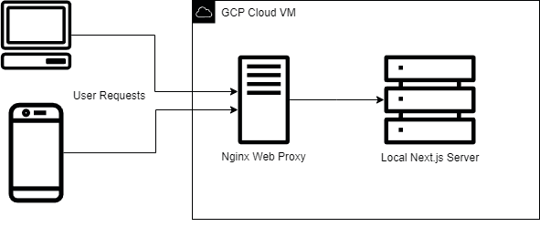

# My Next.js Website

This repository contains a Next.js website and markdown blog with a responsive and dynamic user interface, built using modern frontend tools and frameworks.
Features

- Next.js - Server-side rendering, API routes, and static site generation.
- Tailwind CSS - Customizable and responsive design.
- Mermaid.js - Render interactive diagrams and visualizations.

## Prerequisites

    Node.js (>= 14.x recommended)
    npm or yarn (npm is used in this guide)

## Getting Started
1. Clone the Repository

    git clone https://github.com/your-username/your-repo.git
    cd your-repo

2. Install Dependencies

Install the required packages using npm:

    npm install

Or, if you prefer yarn:

    yarn install

4. Running the Development Server

Start the development server with the following command:

    npm run dev

Or, with yarn:

    yarn dev

The app should now be running at http://localhost:3000.
5. Building and Running in Production

To build the application for production:

    npm run build

Or:

    yarn build

Once built, start the production server:

    npm start

Or:

    yarn start

## Folder Structure

    /src/app: Contains all the Next.js pages.
    /src/app/_components: Reusable components for the app.
    /public: Static assets like images and icons.

## License

This project is licensed under the MIT License.