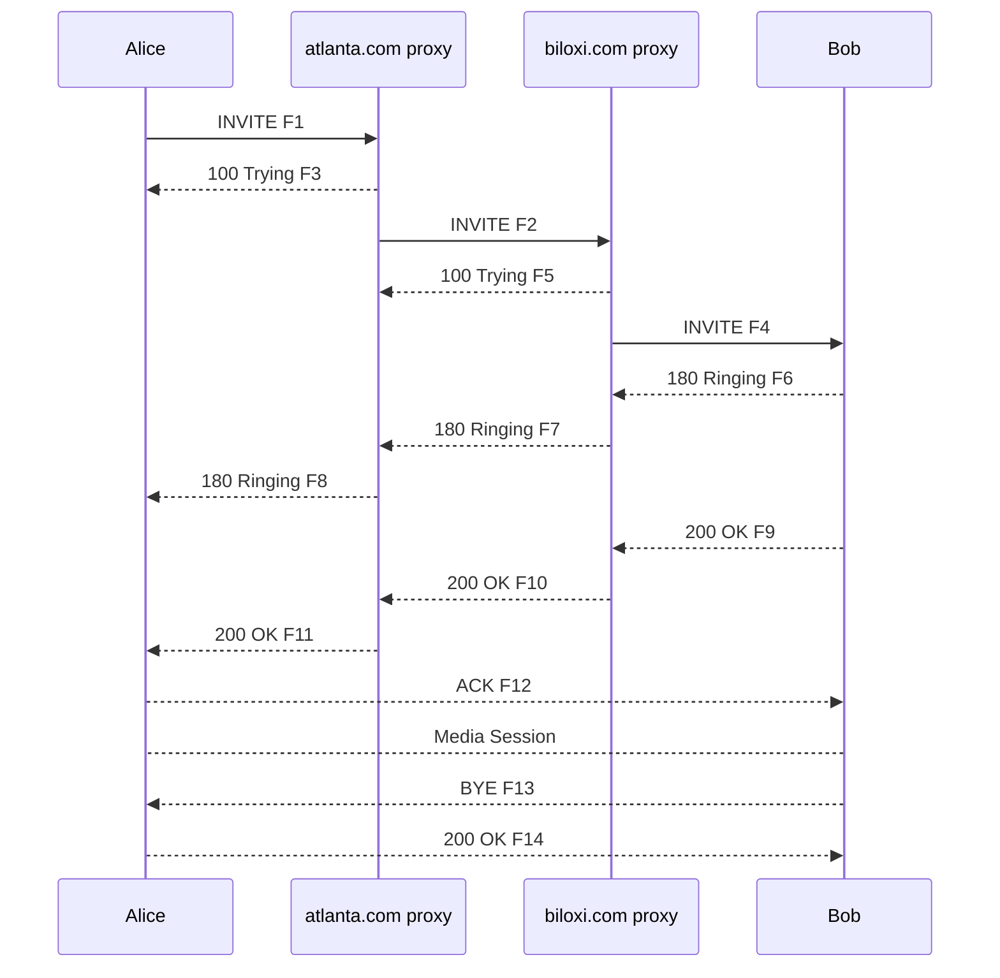

# SIP Protocol

## Introduction

I want to provide a brief overview of one of the lesser known but very important protocols SIP or Session Initiation Protocol which facilitates billions of phone calls a day. All information presented is a condensed and more digestible format of what is found in the original specification or [rfc3261](https://www.ietf.org/rfc/rfc3261.txt).

## What is SIP?

SIP or Session Initiation Protocol is a application layer session management protocol. The idea of SIP is to tackle the complexities of user agents use cases like switching endpoints, being addressable by multiple names or communicating via multiple forms even simultaneously. The protocol can establish, modify, and terminate multimedia sessions e.g. telephony calls.

SIP Supports five facets of establishing and terminating multimedia connections:

1. User location: determination of the end system to be used for communication;
2. User availability: determination of the willingness of the called party to engage in communications;
3. User capabilities: determination of the media and media parameters to be used;
4. Session setup: “ringing”, establishment of session parameters at both called and calling party;
5. Session management: including transfer and termination of sessions, modifying session parameters, and invoking services.

## What isn’t SIP?

SIP is not a vertically integrated communication system, that is to say SIP should be used in conjunction with other protocols like RTSP, PSTN and SDP to provide complete services to users. Alone, SIP does not provide services but primitives that can be used to implement different services. For example SIP can locate a user and deliver an opaque object but if the object contained a session description in SDP then the endpoint could agree on the parameters of a session. Similarly, callerID could be provided by sending photo’s or information of a caller when establishing a session.

## SIP in Action

Consider an example which shows the basic functions of SIP: 

1. Location of an end point
2. Signal of a desire to communicate
3. Negotiation of session parameters to establish the session
4. Teardown of the session once established



### Setting the Scene

Figure 1 shows a typical example of a SIP message exchange between two users, Alice and Bob. (Each message is labeled with the letter “F” and a number for reference by the text.) In this example, Alice uses a SIP application on her PC (referred to as a softphone) to call Bob on his SIP phone over the Internet. 

Also shown are two SIP proxy servers that act on behalf of Alice and Bob to facilitate the session establishment. This typical arrangement is often referred to as the “SIP trapezoid” as shown by the geometric shape of the dotted lines in Figure 1. Alice “calls” Bob using his SIP identity, a type of Uniform Resource Identifier (URI) called a SIP URI. It has a similar form to an email address, typically containing a username and a host name. In this case, it is sip @biloxi.com, where [biloxi.com](http://biloxi.com/) is the domain of Bob’s SIP service provider. Alice has a SIP URI of sip @atlanta.com. Alice might have typed in Bob’s URI or perhaps clicked on a hyperlink or an entry in an address book. 

SIP also provides a secure URI, called a SIPS URI. An example would be sips @biloxi.com. A call made to a SIPS URI guarantees that secure, encrypted transport (namely TLS) is used to carry all SIP messages from the caller to the domain of the callee. From there, the request is sent securely to the callee, but with security mechanisms that depend on the policy of the domain of the callee. SIP is based on an HTTP-like request/response transaction model. 

Each transaction consists of a request that invokes a particular method, or function, on the server and at least one response. In this example, the transaction begins with Alice’s softphone sending an INVITE request addressed to Bob’s SIP URI. INVITE is an example of a SIP method that specifies the action that the requestor (Alice) wants the server (Bob) to take. The INVITE request contains a number of header fields. The ones present in an INVITE include a unique identifier for the call, the destination address, Alice’s address, and information about the type of session that Alice wishes to establish with Bob. The INVITE (message F1 in Figure 1) might look like Figure 2 below.

```yaml
INVITE sip:bob@biloxi.com SIP/2.0
Via: SIP/2.0/UDP pc33.atlanta.com;branch=z9hG4bK776asdhds
Max-Forwards: 70
To: Bob <sip:bob@biloxi.com>
From: Alice <sip:alice@atlanta.com>;tag=1928301774
Call-ID: a84b4c76e66710@pc33.atlanta.com
CSeq: 314159 INVITE
Contact: <sip:alice@pc33.atlanta.com>
Content-Type: application/sdp
Content-Length: 142
```

**SIP Headers**

| Header Name | Description |
| --- | --- |
| Via  | the address (pc33.atlanta.com) at which Alice is expecting to receive responses to this request. It also contains a branch parameter that identifies this transaction. |
| To  | a display name (Bob) and a SIP or SIPS URI (sip@biloxi.com) towards which the request was originally directed. |
| From | a display name (Alice) and a SIP or SIPS URI (sip@atlanta.com) that indicate the originator of the request. This header field also has a tag parameter containing a random string (1928301774) that was added to the URI by the softphone. It is used for identification purposes. |
| Call-ID | a globally unique identifier for this call, generated by the combination of a random string and the softphone’s host name or IP address. The combination of the To tag, From tag, and Call-ID completely defines a peer-to-peer SIP relationship between Alice and Bob and is referred to as a dialog. |
| CSeq or Command Sequence | an integer and a method name. The CSeq number is incremented for each new request within a dialog and is a traditional sequence number. |
| Contact | a SIP or SIPS URI that represents a direct route to contact Alice, usually composed of a username at a fully qualified domain name (FQDN). While an FQDN is preferred, many end systems do not have registered domain names, so IP addresses are permitted. While the Via header field tells other elements where to send the response, the Contact header field tells other elements where to send future requests. |
| Max-Forwards | a limit on the number of hops a request can make on the way to its destination. It consists of an integer that is decremented by one at each hop. |
| Content-Type | a description of the message body. |
| Content-Length | an octet (byte) count of the message body. |

The details of the session, such as the type of media, codec, or sampling rate, are not described using SIP. Rather, the body of a SIP message contains a description of the session, encoded in some other protocol format. One such format is the Session Description Protocol (SDP) (RFC 2327). This SDP message (not shown in the example) is carried by the SIP message in a way that is analogous to a document attachment being carried by an email message, or a web page being carried in an HTTP message. 

### [1] Location of an end point

Since the softphone does not know the location of Bob or the SIP server in the [biloxi.com](http://biloxi.com/) domain, the softphone sends the INVITE to the SIP server that serves Alice's domain, [atlanta.com](http://atlanta.com/). The address of the [atlanta.com](http://atlanta.com/) SIP server could have been configured in Alice's softphone, or it could have been discovered by DHCP, for example. The [atlanta.com](http://atlanta.com/) SIP server is a type of SIP server known as a proxy server. A proxy server receives SIP requests and forwards them on behalf of the requestor. In this example, the proxy server receives the INVITE request and sends a 100 (Trying) response back to Alice's softphone. The 100 (Trying) response indicates that the INVITE has been received and that the proxy is working on her behalf to route the INVITE to the destination. Responses in SIP use a three-digit code followed by a descriptive phrase. This response contains the same To, From, Call-ID, CSeq and branch parameter in the Via as the INVITE, which allows Alice's softphone to correlate this response to the sent INVITE. The [atlanta.com](http://atlanta.com/) proxy server locates the proxy server at [biloxi.com](http://biloxi.com/), possibly by performing a particular type of DNS (Domain Name Service) lookup to find the SIP server that serves the [biloxi.com](http://biloxi.com/) domain. This is described in RFC 3261. As a result, it obtains the IP address of the [biloxi.com](http://biloxi.com/) proxy server and forwards, or proxies, the INVITE request there. Before forwarding the request, the [atlanta.com](http://atlanta.com/) proxy server adds an additional Via header field value that contains its own address (the INVITE already contains Alice's address in the first Via). The [biloxi.com](http://biloxi.com/) proxy server receives the INVITE and responds with a 100 (Trying) response back to the [atlanta.com](http://atlanta.com/) proxy server to indicate that it has received the INVITE and is processing the request. The proxy server consults a database, generically called a location service, that contains the current IP address of Bob.  The [biloxi.com](http://biloxi.com/) proxy server adds another Via header field value with its own address to the INVITE and proxies it to Bob's SIP phone. 

### [2] Signal of a desire to communicate

Bob's SIP phone receives the INVITE and alerts Bob to the incoming call from Alice so that Bob can decide whether to answer the call, that is, Bob's phone rings. Bob's SIP phone indicates this in a 180 (Ringing) response, which is routed back through the two proxies in the reverse direction. Each proxy uses the Via header field to determine where to send the response and removes its own address from the top. As a result, although DNS and location service lookups were required to route the initial INVITE, the 180 (Ringing) response can be returned to the caller without lookups or without state being maintained in the proxies. This also has the desirable property that each proxy that sees the INVITE will also see all responses to the INVITE. When Alice's softphone receives the 180 (Ringing) response, it passes this information to Alice, perhaps using an audio ringback tone or by displaying a message on Alice's screen. In this example, Bob decides to answer the call. When he picks up the handset, his SIP phone sends a 200 (OK) response to indicate that the call has been answered. The 200 (OK) contains a message body with the SDP media description of the type of session that Bob is willing to establish with Alice. As a result, there is a two-phase exchange of SDP messages: Alice sent one to Bob, and Bob sent one back to Alice. This two-phase exchange provides basic negotiation capabilities and is based on a simple offer/answer model of SDP exchange. If Bob did not wish to answer the call or was busy on another call, an error response would have been sent instead of the 200 (OK), which would have resulted in no media session being established. The 200 (OK) might look like the Figure 3 below as Bob sends it out:

```yaml
SIP/2.0 200 OK
Via: SIP/2.0/UDP server10.biloxi.com
 ;branch=z9hG4bKnashds8;received=192.0.2.3
Via: SIP/2.0/UDP bigbox3.site3.atlanta.com
 ;branch=z9hG4bK77ef4c2312983.1;received=192.0.2.2
Via: SIP/2.0/UDP pc33.atlanta.com
 ;branch=z9hG4bK776asdhds ;received=192.0.2.1
To: Bob <sip:bob@biloxi.com>;tag=a6c85cf
From: Alice <sip:alice@atlanta.com>;tag=1928301774
Call-ID: a84b4c76e66710@pc33.atlanta.com
CSeq: 314159 INVITE
Contact: <sip:bob@192.0.2.4>
Content-Type: application/sdp
Content-Length: 131

```

The first line of the response contains the response code (200) and the reason phrase (OK). The remaining lines contain header fields. The Via, To, From, Call-ID, and CSeq header fields are copied from the INVITE request. (There are three Via header field values - one added by Alice's SIP phone, one added by the [atlanta.com](http://atlanta.com/) proxy, and one added by the [biloxi.com](http://biloxi.com/) proxy.) Bob's SIP phone has added a tag parameter to the To header field. This tag will be incorporated by both endpoints into the dialog and will be included in all future requests and responses in this call. The Contact header field contains a URI at which Bob can be directly reached at his SIP phone. The Content-Type and Content-Length refer to the message body (not shown) that contains Bob's SDP media information.

In addition to DNS and location service lookups shown in this example, proxy servers can make flexible "routing decisions" to decide where to send a request. For example, if Bob's SIP phone returned a 486 (Busy Here) response, the [biloxi.com](http://biloxi.com/) proxy server could proxy the INVITE to Bob's voicemail server. A proxy server can also send an INVITE to a number of locations at the same time. This type of parallel search is known as forking.

In this case, the 200 (OK) is routed back through the two proxies and is received by Alice's softphone, which then stops the ringback tone and indicates that the call has been answered. Finally, Alice's softphone sends an acknowledgement message, ACK, to Bob's SIP phone to confirm the reception of the final response (200 (OK)). In this example, the ACK is sent directly from Alice's softphone to Bob's SIP phone, bypassing the two proxies. This occurs because the endpoints have learned each other's address from the Contact header fields through the INVITE/200 (OK) exchange, which was not known when the initial INVITE was sent. The lookups performed by the two proxies are no longer needed, so the proxies drop out of the call flow. This completes the INVITE/200/ACK three-way handshake used to establish SIP sessions.

### [3] Negotiation of session parameters to establish the session

Alice and Bob's media session has now begun, and they send media packets using the format to which they agreed in the exchange of SDP. In general, the end-to-end media packets take a different path from the SIP signaling messages.

During the session, either Alice or Bob may decide to change the characteristics of the media session. This is accomplished by sending a re-INVITE containing a new media description. This re-INVITE references the existing dialog so that the other party knows that it is to modify an existing session instead of establishing a new session. The other party sends a 200 (OK) to accept the change. The requestor responds to the 200 (OK) with an ACK. If the other party does not accept the change, he sends an error response such as 488 (Not Acceptable Here), which also receives an ACK. However, the failure of the re-INVITE does not cause the existing call to fail - the session continues using the previously negotiated characteristics.

### [4] Teardown of the session once established

At the end of the call, Bob disconnects (hangs up) first and generates a BYE message. This BYE is routed directly to Alice's softphone, again bypassing the proxies. Alice confirms receipt of the BYE with a 200 (OK) response, which terminates the session and the BYE transaction. No ACK is sent - an ACK is only sent in response to a response to an INVITE request. The reasons for this special handling for INVITE will be discussed later, but relate to the reliability mechanisms in SIP, the length of time it can take for a ringing phone to be answered, and forking. For this reason, request handling in SIP is often classified as either INVITE or non-INVITE, referring to all other methods besides INVITE. 

In some cases, it may be useful for proxies in the SIP signaling path to see all the messaging between the endpoints for the duration of the session. For example, if the [biloxi.com](http://biloxi.com/) proxy server wished to remain in the SIP messaging path beyond the initial INVITE, it would add to the INVITE a required routing header field known as Record-Route that contained a URI resolving to the hostname or IP address of the proxy. This information would be received by both Bob's SIP phone and (due to the Record-Route header field being passed back in the 200 (OK)) Alice's softphone and stored for the duration of the dialog. The [biloxi.com](http://biloxi.com/) proxy server would then receive and proxy the ACK, BYE, and 200 (OK) to the BYE. Each proxy can independently decide to receive subsequent messages, and those messages will pass through all proxies that elect to receive it. This capability is frequently used for proxies that are providing mid-call features.

### Registration

Registration is another common operation in SIP. Registration is one way that the [biloxi.com](http://biloxi.com/) server can learn the current location of Bob. Upon initialization, and at periodic intervals, Bob's SIP phone sends REGISTER messages to a server in the [biloxi.com](http://biloxi.com/) domain known as a SIP registrar. The REGISTER messages associate Bob's SIP or SIPS URI (sip @biloxi.com) with the machine into which he is currently logged (conveyed as a SIP or SIPS URI in the Contact header field). The registrar writes this association, also called a binding, to a database, called the location service, where it can be used by the proxy in the [biloxi.com](http://biloxi.com/) domain. Often, a registrar server for a domain is co-located with the proxy for that domain. It is an important concept that the distinction between types of SIP servers is logical, not physical.

Bob is not limited to registering from a single device. For example, both his SIP phone at home and the one in the office could send registrations. This information is stored together in the location service and allows a proxy to perform various types of searches to locate Bob. Similarly, more than one user can be registered on a single device at the same time.

The location service is just an abstract concept. It generally contains information that allows a proxy to input a URI and receive a set of zero or more URIs that tell the proxy where to send the request. Registrations are one way to create this information, but not the only way. Arbitrary mapping functions can be configured at the discretion of the administrator.

Finally, it is important to note that in SIP, registration is used for routing incoming SIP requests and has no role in authorizing outgoing requests. Authorization and authentication are handled in SIP either on a request-by-request basis with a challenge/response mechanism, or by using a lower layer scheme.

## Key Definitions

- Back-to-Back User Agent: A back-to-back user agent (B2BUA) is a logical entity that receives a request and processes it as a user agent server (UAS). In order to determine how the request should be answered, it acts as a user agent client (UAC) and generates requests. Unlike a proxy server, it maintains dialog state and must participate in all requests sent on the dialogs it has established. Since it is a concatenation of a UAC and UAS, no explicit definitions are needed for its behavior.
- Call: A call is an informal term that refers to some communication between peers, generally set up for the purposes of a multimedia conversation.
- Dialog: A dialog is a peer-to-peer SIP relationship between two UAs that persists for some time. A dialog is established by SIP messages, such as a 2xx response to an INVITE request. A dialog is identified by a call identifier, local tag, and a remote tag. A dialog was formerly known as a call leg in RFC 2543.
- Initiator, Calling Party, Caller: The party initiating a session (and dialog) with an INVITE request. A caller retains this role from the time it sends the initial INVITE that established a dialog until the termination of that dialog.
- Invitee, Invited User, Called Party, Callee: The party that receives an INVITE request for the purpose of establishing a new session. A callee retains this role from the time it receives the INVITE until the termination of the dialog established by that INVITE.
- Proxy, Proxy Server: An intermediary entity that acts as both a server and a client for the purpose of making requests on behalf of other clients. A proxy server primarily plays the role of routing, ensuring that a request is sent to another entity "closer" to the targeted user. Proxies are also useful for enforcing policy (for example, ensuring a user is allowed to make a call). A proxy interprets and, if necessary, rewrites specific parts of a request message before forwarding it.
- Session: From the SDP specification: "A multimedia session is a set of multimedia senders and receivers and the data streams flowing from senders to receivers. A multimedia conference is an example of a multimedia session." (RFC 2327) (A session as defined for SDP can comprise one or more RTP sessions.) As defined, a callee can be invited several times, by different calls, to the same session. If SDP is used, a session is defined by the concatenation of the SDP user name, session id, network type, address type, and address elements in the origin field.
- User Agent Client (UAC): A user agent client is a logical entity that creates a new request and uses the client transaction state machinery to send it. The role of UAC lasts only for the duration of that transaction. In other words, if a piece of software initiates a request, it acts as a UAC for the duration of that transaction. If it receives a request later, it assumes the role of a user agent server for the processing of that transaction.
- User Agent Server (UAS): A user agent server is a logical entity that generates a response to a SIP request. The response accepts, rejects, or redirects the request. This role lasts only for the duration of that transaction. In other words, if a piece of software responds to a request, it acts as a UAS for the duration of that transaction. If it generates a request later, it assumes the role of a user agent client for the processing of that transaction.
- User Agent (UA): A logical entity that can act as both a user agent client and user agent server.

## Phone calls use SIP?

Yes! Let’s consider a phone call made between Alice’s cell phone on Verizon and Bob’s cell phone on AT&T. Verizon and AT&T are considered phone service providers, they posses equipment like cell towers with receivers and transmitters, IMS’s (IP Multimedia Subsystem) and they each have access to the PSTN (public switched telephone network). When Alice calls Bob the call is routed to a connected Verizon tower, this tower propagates to Verizon’s IMS which initiates the SIP connection. The IMS performs task such as resolving Bob’s number to an IP if it is within the network or sending it over the PSTN if it cannot handle the connection within Verizon (our case). Afterwards the SIP packet is picked up by an AT&T IMS and eventually routed to Bob using a HSS (Home Subscriber Server). As mentioned above SIP is only used to manage the connection state and so actual voice data would be sent using a protocol like RTP (Real-Time Transport Protocol).

## Conclusion

In summary, SIP (Session Initiation Protocol) is a powerful protocol for managing multimedia communications, especially within telephony and IP-based voice systems. It provides a flexible, decentralized way to establish, manage, and terminate sessions between endpoints, making it fundamental for the billions of calls and video sessions that occur daily. Unlike integrated systems, SIP works alongside other protocols like RTP and SDP to deliver complete services, providing a modular approach to session management. Through features like user location, capability negotiation, and session teardown, SIP remains adaptable to the varied needs of modern communication networks.